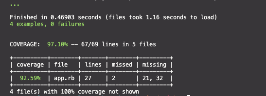

# Capplication

A simple web application built in couple of hours from scratch with Sinatra and HTTP library. Users can view cat images, favourite and unfavourite them, view their favourite cats and search for cat desciptions by breed.

I have followed TDD approach, focusing on clean code with clear names, small/frequent commits and well-written tests as much as I can throughout the developement of the program (See Git history and coverage report below).

All Http requests have been stubbed and responses mocked.

All tests are passing. App test coveragage: > [97%](#Screen_Preview)

## Running the program

### Setup

1. Clone this repo.
2. Install dependencies with:

   ```zsh
   bundle
   ```

## Tech Stack

- Sinatra
- Rspec and Capybara for testing
- Rubocop for linting
- Simplecov for test coverage

## Run tests:

```zsh
rspec
```

## Running the app

```zsh
ruby app.rb
```

This will serve the application on `localhost:4567` when using the default configuration.

### Screen Preview



### Future Work

- More aethetic frontend - currently the user interface looks bare due to lack of time and focus on functionality.
- To refactor tests for DRY code - to use fixtures to set-up the testing environment, to focus on application logic and testing behavior. Currently, I have mocked the expected response from the endpoint.
- To build the backend using our own database to store images liked by specific users and to further customise functionalities provided by the CAT API for our program.
- Unit tests to test small functionalities of the program in isolation.
